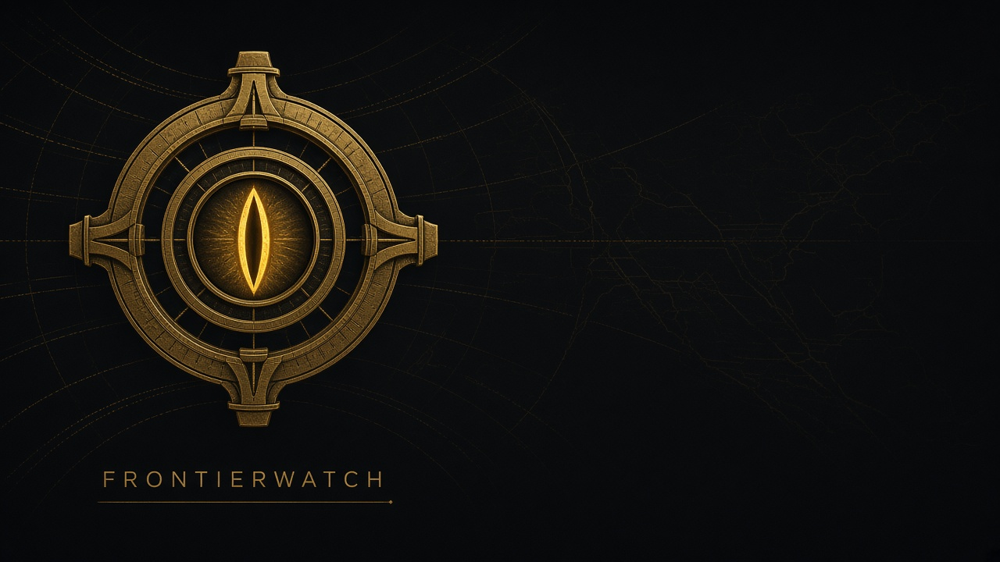

# FrontierWatch

On-device browser extension that watches a page for **frontier-model activity** and answers two questions: **which lab** (when the catalog knows) and **Unknown** when the build is private, unreleased, self-hosted, or newer than anything public.

Catalog date: **2026-09-24** — GPT-6 Astra, Claude Fable / Mythos 5.1, Gemini 3.8, Grok 4.7, DeepSeek V4.1, Qwen3.8, Kimi K3, GLM-5.3, Llama 4, Muse Spark, and the image/video labs (Sora, Flux, Firefly, Midjourney, Seedream).

Repo: [github.com/AaronGrace978/FrontierWatch](https://github.com/AaronGrace978/FrontierWatch)

## What it does

| Surface | What you get |
|---|---|
| **This page** | Live findings + origin card (lab, HQ, country, public vs unknown) |
| **Alert log** | Rolling history with confidence, export / clear |
| **Origin atlas** | Labs seen this session, including **Unknown / unreleased** |
| **Network** | Observes calls to provider APIs *and* gateways (OpenRouter, Bedrock, Vertex, Groq, Together, …) |

Everything stays on-device. No telemetry.

## Detection stack

| Engine | What it catches |
|---|---|
| **Catalog + frontier ceiling** | Named public models; versions *above* the latest public release are flagged as unreleased |
| **Lineage** | Chat templates (Harmony, Llama 3, ChatML, Gemma, GLM, Kimi, Granite, [INST]…), assistant UI leftovers (ChatGPT `oaicite`, Gemini `[cite_start]`, Claude artifacts) |
| **Unknown lab** | Internal IDs, stealth OpenRouter slugs, local Ollama/LM Studio, unbranded markup |
| **Hidden Unicode** | Tag-character ASCII smuggling, variation-selector byte hides, long zero-width / bidi (Trojan Source) |
| **Image provenance** | C2PA Content Credentials, IPTC `trainedAlgorithmicMedia`, China [GB 45438-2025](https://www.chinesestandard.net/) AIGC labels, SD WebUI / ComfyUI parameters |
| **Agent traps / exfil** | Ignore-previous-instructions, ngrok/oastify sinks, hidden DOM directives |

Discussion hosts (news, GitHub, Wikipedia, lab blogs) down-score a bare model name so a NYT article is not an “attack.”

## Install (developer mode)

1. Clone [this repo](https://github.com/AaronGrace978/FrontierWatch).
2. Open `chrome://extensions` (or `edge://extensions`).
3. Enable **Developer mode**.
4. **Load unpacked** → this folder.
5. Open `fixtures/origin-demo.html`. Badge fills when something trips.

## Tests

```
node test.js
```

## Privacy

Scans run in the page and the service worker. Findings live in `chrome.storage.local`. FrontierWatch does not send your pages anywhere; it only *observes* requests the page already makes.

## Disclaimer

Heuristic research tool. Origin cards are not forensic proof that a given lab authored or deployed content.
